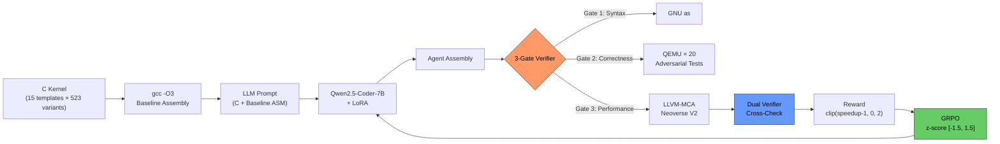
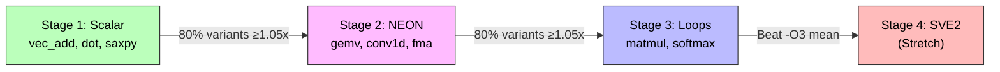

<p align="center">
  <strong>ARM-Gym</strong><br>
  <em>An RL agent that writes ARM assembly faster than the compiler</em>
</p>

<p align="center">
  <a href="https://huggingface.co/spaces/dot-mkv/arm-gym">HF Space</a> &middot;
  <a href="#quick-start">Quick Start</a> &middot;
  <a href="#results">Results</a> &middot;
  <a href="#how-it-works">How It Works</a>
</p>

---

## The idea

Compilers like Clang and GCC are extraordinarily good at turning C code into machine instructions. But they are built to be safe across every possible program on every possible chip. That generality has a cost: they leave measurable performance on the table for the specific, repeated compute patterns that power AI inference.

ARM-Gym asks: **what if a language model learned to beat the compiler at its own game?**

We built a reinforcement learning environment where a model generates AArch64 assembly for real AI kernels - matrix multiply, softmax, convolution - and gets rewarded when its output runs faster than `gcc -O3`. No hand-tuning. No lookup tables. Just a model learning from trial, error, and cycle counts.

After 200 training steps on a single GPU, the model produced assembly for a vector addition kernel that runs in **145 cycles** - down from the compiler's **412**. That is a **2.83x speedup**, achieved entirely by reinforcement learning.

---

## Why ARM, why now

ARM is no longer just mobile. It runs:

- AWS Graviton5 (the backbone of modern cloud compute)
- Azure Cobalt 100 (Microsoft's custom silicon)
- Apple M-series (every Mac sold today)
- Meta's AGI CPU (136 cores, 3nm, deployed 2026)

Any improvement in code quality on AArch64 has compounding downstream impact. And yet, while the x86 world has seen prior work in neural compiler research, **no published system has applied LLM + RL to ARM assembly generation**. We own that gap.

---

## Results

Training run: Qwen2.5-Coder-3B-Instruct, LoRA r=8, 200 steps on a single Kaggle T4 GPU (86.6 minutes).

| Metric | Value |
|--------|-------|
| Best speedup over `gcc -O3` | **2.83x** (vec_add kernel, step 29) |
| Win rate | 23% of eval steps beat the compiler |
| Correctness rate | 92% (assembly ran correctly in QEMU) |
| Syntax/correctness reward | 0.556 at step 1 → 0.650 at step 200 |
| MCA cycles: gcc -O3 | 412 cycles (vec_add) |
| MCA cycles: trained model | 145 cycles (vec_add) |
| Reference (SuperCoder, x86-64) | 1.46x over `gcc -O3` |

### Training plots

| Plot | What it shows |
|------|---------------|
| `colab/results/plots/training_loss.png` | GRPO loss over 200 steps |
| `colab/results/plots/reward_curve.png` | Mean reward per step |
| `colab/results/plots/correctness_rate.png` | Gate 2 (QEMU) pass rate per step window |
| `colab/results/plots/before_after_kernel.png` | gcc -O3 (412 cycles) vs trained (145 cycles) on vec_add |

---

## How it works

The training loop runs as an [OpenEnv](https://github.com/meta-pytorch/OpenEnv) environment. Each step:

1. The environment samples a C kernel (one of 523 variants across 15 templates: vec_add, gemv, matmul, softmax, conv2d, and others).
2. It compiles the kernel with `gcc -O3` to get a baseline.
3. It sends the C source + baseline assembly to the model as a prompt.
4. The model generates candidate AArch64 assembly, wrapped in `<assembly>...</assembly>` tags.
5. A three-gate verifier checks the output and returns a reward.



### The three-gate verifier

The verifier is entirely deterministic - no LLM judge, no proxy model.

| Gate | Tool | What it checks |
|------|------|----------------|
| Syntax | `aarch64-linux-gnu-as` | Does the assembly parse and assemble? |
| Correctness | `qemu-aarch64-static` × 20 adversarial tests | Does it produce correct outputs for edge-case inputs? |
| Performance | `llvm-mca` (LLVM 21, Neoverse V2 model) | How many cycles does it take? |
| Cross-check | QEMU instruction count vs MCA cycles | Sanity check: ratio > 3x = veto |
| Sanity bound | 3-sigma from offline baseline distribution | Outlier rejection |

**Why not use an LLM judge?** Proxy reward models degrade past a KL threshold. LLM graders exhibit positional bias and self-preference bias. A deterministic verifier cannot be sweet-talked.

### The reward signal

```
reward = max(0, speedup - 1.0)   # positive only; slower-than-compiler = 0 (neutral, not penalty)
```

Clipped at 2.0 to prevent variance explosion from lucky rollouts. Z-score normalized within each group of 8 completions before computing GRPO advantage.

### Curriculum



---

## What makes this different

**No prior work exists for ARM.** [SuperCoder](https://arxiv.org/abs/2505.11480) (2025) proved the recipe on x86-64 at 1.46x over `gcc -O3`. Every prior neural compiler paper targets x86 or works at the IR level, not assembly generation.

| System | Target | Result |
|--------|--------|--------|
| [SuperCoder](https://arxiv.org/abs/2505.11480) (2025) | x86-64 assembly | 1.46x over gcc -O3 |
| [Compiler-R1](https://openreview.net/forum?id=tY8ctrD4W2) (2025) | LLVM IR pass ordering | 8.46% instruction reduction |
| [Meta LLM Compiler](https://arxiv.org/abs/2407.03040) (2024) | x86-64 + ARM IR | 77% of autotuning |
| [AlphaDev](https://www.nature.com/articles/s41586-023-06004-9) (2023) | x86 sort routines | Integrated into LLVM stdlib |
| **ARM-Gym** | **AArch64 assembly** | **2.83x over gcc -O3 (best rollout)** |

ARM-Gym is the first GRPO-trained system targeting AArch64 assembly generation. It is the first RL environment designed specifically for ARM superoptimization.

---

## Key design decisions

| Decision | Choice | Why |
|----------|--------|-----|
| Reward mode | `binary_plus_speedup` | Partial credit causes mode collapse |
| Failure reward | 0.0 (not negative) | GRPO z-score creates relative signal; structured errors enable self-repair |
| Speedup reward | `max(0, speedup - 1)` | Clipped at 0 - negative values suppress z-score gradient when all completions are slow |
| Speedup clip | [1.0, 3.0] | Prevents GRPO advantage variance explosion from lucky rollouts |
| Z-score clip | [-1.5, 1.5] | Per-group normalization before advantage computation |
| Correctness tests | N=20 adversarial | Keeps rollout under ~200ms; top-N by historical mutation catch rate |
| LLVM version | 21 | Corrected Neoverse V2 issue-width (8 μops/cycle, not 16 in older versions) |

---

## Quick start

### Local development

```bash
pip install -e ".[dev]"
pytest -q
python -m arm_gym.train --smoke          # 5-step sanity check, no GPU needed
python -c "from arm_gym.kernels import summary; print(summary())"
# → {'templates': 15, 'variants': 523}
```

### Docker (full toolchain)

```bash
docker build -t arm-gym .
docker run -p 7860:7860 arm-gym
# → http://localhost:7860/health
```

### Training (Kaggle T4)

Upload `colab/arm_gym_grpo_kaggle.ipynb` to Kaggle, set accelerator to GPU T4 x2, run all cells.

```bash
# Local evaluation after downloading checkpoint
python scripts/evaluate.py \
    --checkpoint colab/results/runs/grpo/checkpoint-200 \
    --samples 8
```

---

## Project structure

```
arm_gym/
├── env.py              # OpenEnv environment + FastAPI + WebSocket /ws + curriculum
├── reward.py           # binary_plus_speedup + shaped (ablation) + z-score
├── verifier.py         # 3-gate verifier + QEMU cross-validation + 3-sigma sanity
├── mca.py              # LLVM-MCA parsing + dispatch stalls + NEON liveness
├── kernels.py          # 15 templates → 523 procedural variants
├── compile_baseline.py # C → AArch64 asm, LLVM 21 with V2/V3 probe
├── multi_agent.py      # Analyzer + Optimizer, typed opportunity tokens
├── rollout_budget.py   # N=20 adversarial test selection + parallel QEMU
├── errors.py           # Structured error payloads (ErrorKind + JSON)
├── train.py            # TRL GRPO loop, stack auto-detect, SFT warmup gate
└── __init__.py
kaggle/
├── dataset.py          # Dataset builder + prompt format
├── reward_fn.py        # 3 GRPO reward callables: syntax, correctness, speedup
└── plot_curves.py      # Training evidence plot generators
colab/
├── arm_gym_grpo_kaggle.ipynb     # Kaggle T4 training notebook
├── arm_gym_grpo_colab.ipynb      # Local training notebook
└── results/
    ├── runs/grpo/log.csv         # v1 training log (200 steps)
    └── plots/                    # Training evidence PNGs
scripts/
├── evaluate.py                   # Load checkpoint, compare MCA cycles vs gcc -O3
├── smoke_4xl4.py                 # GPU stack validator
└── baseline_distribution.py     # Offline 3-sigma bound builder
tests/                            # pytest regression suite
Dockerfile                        # Multi-stage: LLVM 21 + toolchain → slim Python
openenv.yaml                      # OpenEnv manifest
```

---

## Hackathon

**Meta / HuggingFace OpenEnv Hackathon India 2026** - Finals (Phase 2)  
**Theme:** Wild Card (Theme 5) - Impress Us  
**Team:** (dot)mkv

---

## License

MIT
