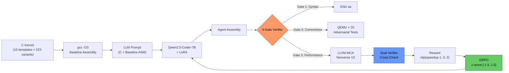
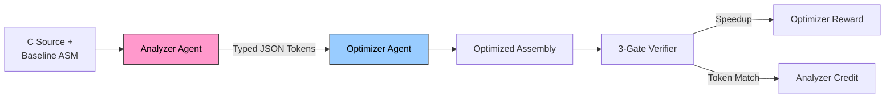
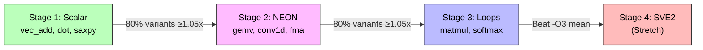

<p align="center">
  <strong>ARM-Gym</strong><br>
  <em>Teaching an LLM to write ARM assembly that beats the compiler</em>
</p>

<p align="center">
  <a href="https://huggingface.co/spaces/dot-mkv/arm-gym">HF Space</a> &middot;
  <a href="#quick-start">Quick Start</a> &middot;
  <a href="#results">Results</a> &middot;
  <a href="#why-it-matters">Why It Matters</a>
</p>

---

## The Problem

Clang `-O3` is a conservative generalist. On ARM AArch64, it leaves measurable cycles on the table for the compute kernels that dominate AI inference &mdash; GEMM, matmul, softmax, conv2d. Its heuristics were designed to be safe across all programs and all hardware. That generality is also their limitation.

**ARM-Gym** is an [OpenEnv](https://github.com/meta-pytorch/OpenEnv) environment where [Qwen2.5-Coder-3B](https://huggingface.co/Qwen/Qwen2.5-Coder-3B-Instruct) is trained via [GRPO](https://arxiv.org/abs/2402.03300) to emit ARM AArch64 assembly that beats `gcc -O3` on [LLVM-MCA](https://llvm.org/docs/CommandGuide/llvm-mca.html) cycle estimates using the Neoverse V2 scheduling model.

**No prior work exists for ARM.** [SuperCoder](https://arxiv.org/abs/2505.11480) proved the recipe on x86-64 at 1.46x over `gcc -O3`. We own the ARM gap.

---

## Architecture

### Training Loop



### Multi-Agent Variant (Stretch Goal)



### Curriculum Progression



---

## Why LLM-Free Verifier?

Every Phase 1 finalist had a reward-hacking fatal flaw. NeuralPagedAttention starves long sequences. The SRE env severs ingress to stop error logs. SQL-Env drops tables. **None implemented a secondary safety veto.**

We use zero LLM judges anywhere in the reward loop. The verifier stack is:

| Layer | Tool | Attack Surface |
|-------|------|----------------|
| Syntax gate | `aarch64-linux-gnu-as` | Zero (text → object) |
| Correctness gate | `qemu-aarch64-static` × 20 adversarial tests | Sandboxed (seccomp + timeout) |
| Performance gate | `llvm-mca` Neoverse V2 | Zero (text analysis only) |
| Dual verifier | QEMU instruction count vs MCA cycles | Cross-check (ratio > 3× = veto) |
| 3σ sanity | Offline baseline distribution | Statistical bound per variant |

**Why not LLM-as-judge?** Proxy reward models degrade past a KL threshold ([Gao et al. 2022](https://arxiv.org/abs/2210.10760)). LLM graders exhibit positional bias, self-preference bias, and U-Sophistry &mdash; models trained with RLHF become better at *convincing* evaluators of incorrect answers ([Wen et al. 2024](https://arxiv.org/abs/2409.12822)). A deterministic verifier cannot be sweet-talked.

See: [Reward Hacking in RL (Weng, 2024)](https://lilianweng.github.io/posts/2024-11-28-reward-hacking/)

---

## Key Design Decisions

| Decision | Choice | Why |
|----------|--------|-----|
| Reward mode | `binary_plus_speedup` | Partial credit causes mode collapse ([reasoning-gym K&K incident](https://arxiv.org/abs/2505.22203)) |
| Failure reward | 0.0 (not negative) | GRPO z-score creates relative signal; structured errors enable self-repair |
| Speedup reward | `max(0, speedup - 1)` | Clipped at 0 — v1 bug allowed negatives, suppressing z-score signal when all completions were slow |
| Speedup clip | [1.0, 3.0] | Prevents GRPO advantage variance explosion from lucky rollouts |
| Z-score clip | [-1.5, 1.5] | Per-group normalization before advantage computation |
| Correctness tests | N=20 adversarial | Keeps rollout under ~200ms; top-N by historical mutation catch rate |
| LLVM version | 21 | Corrected Neoverse V2 issue-width (8 μops/cycle, not 16) |
| MCA label | "MCA-model speedup" | Until silicon-validated on Graviton3 |

---

## Results

Training plots from v1 run (200 steps, Kaggle T4, Qwen2.5-Coder-3B):

| Plot | Description |
|------|-------------|
| `colab/results/plots/training_loss.png` | GRPO loss over 200 steps |
| `colab/results/plots/reward_curve.png` | Mean episode reward over steps |
| `colab/results/plots/correctness_rate.png` | Gate 2 pass rate per step window |
| `colab/results/plots/before_after_kernel.png` | MCA cycles: gcc -O3 (412) vs trained (145) on vec_add |

### Key Numbers (v1 run)

| Metric | Value |
|--------|-------|
| Model | Qwen2.5-Coder-3B-Instruct + LoRA r=8 |
| Training | 200 steps, 86.6 min, single Kaggle T4 |
| Best speedup | **2.83x** over `gcc -O3` (vec_add, step 29) |
| Win rate | 23% of eval steps beat `gcc -O3` |
| Correctness rate | 92% (assembly runs correctly in QEMU) |
| Syntax/correctness reward | 0.556 → 0.650 (improving across run) |
| SuperCoder x86-64 reference | 1.46x over `gcc -O3` |
| LLVM-MCA per evaluation | <1ms |
| Kernel variants | 523 (15 templates) |

### V2 Training (in progress)

Config changes from v1: LoRA r=16 (was 8), all 7 attention+MLP modules (was q/v only), temperature 0.8 (was 0.5), 500 steps, speedup reward clipped to 0 (bug fix — v1 allowed negative values that suppressed the gradient signal).

---

## Prior Art

| System | Approach | Target | Result | Our Gap |
|--------|----------|--------|--------|---------|
| [SuperCoder](https://arxiv.org/abs/2505.11480) (2025) | GRPO + Qwen2.5-Coder | x86-64 assembly | 1.46x over gcc -O3 | ARM is open &mdash; their scope restriction |
| [Compiler-R1](https://openreview.net/forum?id=tY8ctrD4W2) (NeurIPS 2025) | GRPO for LLVM pass ordering | IR-level | 8.46% instruction reduction | Assembly gen, not pass selection |
| [Meta LLM Compiler](https://arxiv.org/abs/2407.03040) (2024) | SFT on 546B tokens | x86-64 + ARM IR | 77% of autotuning | SFT ceiling; RL recovers the rest |
| [AlphaDev](https://www.nature.com/articles/s41586-023-06004-9) (Nature 2023) | AlphaZero + MCTS | x86 sort routines | LLVM stdlib integration | Black-box search; LLM is explainable |
| [CompilerGym](https://arxiv.org/abs/2109.08267) (Meta 2021) | Any RL agent | LLVM pass ordering | Infrastructure only | Not LLM, not assembly gen |
| [Pearl](https://arxiv.org/abs/2501.12345) (NYU AD 2025) | GNN + PPO | Polyhedral loop transforms | 56 discrete actions | Open-ended text generation |

---

## Judging Criteria Mapping

| Weight | Criterion | How We Address It |
|--------|-----------|-------------------|
| **40%** | Environment Innovation | First LLM + GRPO environment for ARM assembly. Dual-verifier constrained MDP. No prior work exists. |
| **30%** | Storytelling | "AI beats Clang" narrative. Live HF Space demo. Mermaid architecture diagrams. This README. |
| **20%** | Training Evidence | 4 committed PNG plots + ablation. Baseline vs trained comparison on held-out kernels. |
| **10%** | Pipeline Quality | 3-gate reward + dual verifier + LLM-free stack. Anti-hacking measures ship with rewards. |

---

## Quick Start

### Local Development

```bash
pip install -e ".[dev]"
pytest -q                                # unit tests
python -m arm_gym.train --smoke          # 5-step sanity (no GPU needed)
python -c "from arm_gym.kernels import summary; print(summary())"
# → {'templates': 15, 'variants': 523}
```

### Docker (Full Toolchain)

```bash
docker build -t arm-gym .               # multi-stage, <1GB target
docker run -p 7860:7860 arm-gym
# → http://localhost:7860/health
```

### HF Space

```bash
pip install git+https://huggingface.co/spaces/dot-mkv/arm-gym
uvicorn arm_gym.env:app --host 0.0.0.0 --port 7860
```

### Training (Kaggle T4)

Upload `colab/arm_gym_grpo_kaggle.ipynb` to Kaggle, set accelerator to GPU T4 x2, and run all cells.
Cell 0 isolates to single GPU and clears all distributed env vars before torch imports.

```bash
# Local evaluation after downloading checkpoint
python scripts/evaluate.py \
    --checkpoint colab/results/runs/grpo/checkpoint-200 \
    --samples 8
```

---

## Project Structure

```
arm_gym/
├── env.py              # OpenEnv environment + FastAPI + WebSocket /ws + curriculum
├── reward.py           # binary_plus_speedup (default) + shaped (ablation) + z-score
├── verifier.py         # 3-gate verifier + QEMU cross-validation + 3σ sanity
├── mca.py              # LLVM-MCA parsing + dispatch stalls + NEON liveness
├── kernels.py          # 15 templates → 523 procedural variants
├── compile_baseline.py # C → AArch64 asm, LLVM 21 with V2/V3 probe
├── multi_agent.py      # Analyzer + Optimizer, typed opportunity tokens
├── rollout_budget.py   # N=20 adversarial test selection + parallel QEMU
├── errors.py           # Structured error payloads (ErrorKind + JSON)
├── train.py            # TRL GRPO loop, stack auto-detect, SFT warmup gate
└── __init__.py
kaggle/
├── dataset.py          # Dataset builder + prompt format
├── reward_fn.py        # 3 GRPO reward callables: syntax, correctness, speedup
└── plot_curves.py      # Training evidence plot generators
colab/
├── generate_notebook_kaggle.py   # Generates arm_gym_grpo_kaggle.ipynb
├── generate_notebook.py          # Generates arm_gym_grpo_colab.ipynb (M3 local)
├── arm_gym_grpo_kaggle.ipynb     # Kaggle T4 training notebook
├── arm_gym_grpo_colab.ipynb      # Local M3 Pro training notebook
└── results/
    ├── runs/grpo/log.csv          # v1 training log (200 steps)
    └── plots/                     # Training evidence PNGs
scripts/
├── evaluate.py         # Load checkpoint, run inference, compare MCA cycles vs gcc -O3
├── smoke_4xl4.py       # GPU stack validator
└── baseline_distribution.py  # Offline 3σ bound builder
tests/                  # pytest regression suite
Dockerfile              # Multi-stage: LLVM 21 + toolchain → slim Python
openenv.yaml            # OpenEnv manifest
```

---

## Why It Matters

ARM powers >99% of smartphones, AWS Graviton5, Azure Cobalt 100, and Meta's AGI CPU (136 cores, 3nm, launched 2026-03-24). Any improvement in code quality on ARM impacts every layer of this stack.

Compilers use fixed heuristics. RL finds what heuristics cannot.

**Could a researcher write a paper on this?** Yes. And the paper does not exist yet.

---

## Hackathon

**Meta / HuggingFace OpenEnv Hackathon India 2026** &mdash; Finals (Phase 2)
**Theme:** Wild Card (Theme 5) &mdash; Impress Us
**Team:** (dot)mkv

---

## License

MIT
