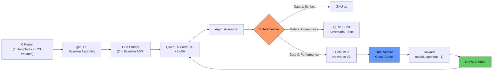
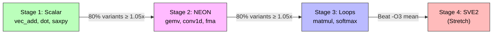

# We trained an AI to write faster ARM assembly than the compiler

Some ideas start with a paper.

In January 2026, a team from Stanford and UIUC published [SuperCoder](https://arxiv.org/abs/2505.11480) - a system that trained a language model to write assembly code faster than `gcc -O3`, the most aggressive optimization setting of the world's most widely used compiler. Their result: 1.46x average speedup. On x86-64. With a 7 billion parameter model trained via reinforcement learning.

The paper was explicit about one thing it did not do: ARM.

> "Extending to ARM, RISC-V, and GPU kernels is noted as future work."

That sentence is where ARM-Gym begins.

---

## What this is about, for everyone

Before getting into what we built, here is the context for anyone who does not spend their days thinking about compilers and processors.

**What is a compiler?**

A compiler is a program that takes code written in a high-level language like C and translates it into machine instructions. GCC and Clang are the two most important compilers in existence. When you compile with `-O3`, you are asking the compiler to apply every optimization it knows. It inlines functions, unrolls loops, reorders instructions to avoid stalls, selects faster instruction variants where it can.

GCC has been doing this for decades. Thousands of engineer-years have gone into making `-O3` as good as it is.

**And yet.**

Compilers must be conservative. A compiler cannot make an assumption that might be wrong for even one program. It cannot take a risk that improves performance 99% of the time but breaks the other 1%. It follows rules. Rules generalize but do not specialize.

**What is ARM?**

ARM is a processor architecture - a specific design for how machine instructions are structured and executed. For a long time, ARM meant smartphones. That is no longer true. Today:

- AWS Graviton5 - the most widely deployed cloud compute in the world - runs on ARM
- Azure Cobalt 100, Microsoft's custom data center chip, runs on ARM
- Every Apple Mac sold since 2020 runs on ARM
- Meta's AGI CPU - 136 cores, 3nm fabrication, deployed in 2026 - runs on ARM

Any improvement in how efficiently code runs on ARM touches all of that. And the specific code that matters most is the tight computational loops inside AI inference: matrix multiply, softmax, convolution. These functions run millions of times per second in every large model deployment.

---

## The research that made this possible: SuperCoder

The SuperCoder paper (Wei et al., arXiv:2505.11480, Stanford/UIUC, 2025) is the direct foundation for what we built. Understanding what they proved is essential for understanding why ARM-Gym is the next step.

### What SuperCoder showed

The paper asked: can a language model learn to write assembly that beats the compiler, purely through reinforcement learning?

They evaluated 23 language models on a benchmark of 8,072 assembly programs (average 130 lines each - far larger than any prior dataset, which maxed out at 15 lines and no loops). Every program came with its `gcc -O3` baseline assembly and a set of test cases.

The base model they chose for training was Qwen2.5-Coder-7B-Instruct - not because it was the strongest baseline, but because it had the highest test pass rate (61.4%) among open-source models, leaving the most room to improve. Claude-opus-4 had a slightly higher average speedup (1.43x) but was not open-source and could not be fine-tuned.

They trained using both PPO and GRPO. The reward function was simple: if the generated assembly compiles, passes all test cases, and runs faster than `gcc -O3`, the reward equals the speedup. Otherwise, zero. No partial credit. No reward for being partially correct.

That last point turned out to matter a lot. They tested an alternative reward that gave partial credit for passing some tests - and it performed worse (1.38x vs 1.46x). The lesson: partial credit lets the model avoid putting in the work of actually being correct and fast. Binary pass/fail forces it.

### The results

| Model | Correctness before training | Correctness after | Avg speedup |
|---|---|---|---|
| Qwen2.5-Coder-7B (base) | 61.4% | - | 1.10x |
| SuperCoder (GRPO) | - | 95.0% | 1.44x |
| SuperCoder (PPO) | - | 95.0% | 1.46x |

Correctness jumped from 61.4% to 95%. Average speedup went from 1.10x to 1.46x. The model went from occasionally beating the compiler to reliably beating it.

One more finding worth noting: 98.5% of the speedup came from instruction scheduling and code layout - reordering instructions and basic blocks to better hide latency and avoid pipeline stalls. Not exotic instruction selection. The model learned that the compiler's instruction order is not optimal, and found better orderings.

### What SuperCoder did not do

It targeted x86-64 only. The paper uses the IBM CodeNet dataset, which contains competitive programming submissions compiled for x86. ARM was explicitly outside scope.

ARM has a completely different instruction set. Different SIMD extensions (NEON, SVE2 instead of AVX/SSE). Different pipeline characteristics. Different scheduler model. Different optimization opportunities. A model trained on x86 assembly cannot be directly applied to ARM.

That is the gap ARM-Gym fills.

---

## What we built: ARM-Gym

ARM-Gym is a reinforcement learning environment built on [OpenEnv](https://github.com/meta-pytorch/OpenEnv), the framework from Meta and Hugging Face. The task is identical to SuperCoder's in structure - generate assembly that beats `gcc -O3` - but the target is AArch64 (ARM's 64-bit architecture) and the kernels are specifically chosen to be representative of AI inference workloads.

### The kernel library

We wrote 15 C function templates covering the operations that dominate AI inference:

- Vector operations: `vec_add`, `dot_product`, `saxpy`
- Matrix operations: `gemv`, `matmul`
- Activation and normalization: `softmax`, `layer_norm`
- Convolution: `conv1d`, `conv2d`
- Elementwise: `relu`, `gelu`, `silu`, `fma`

From these 15 templates, we generate 523 variants by varying sizes, data types (float32, float16, int8), and parameters. This gives the training loop enough diversity to prevent memorization while staying domain-relevant.

### The training loop

Here is exactly how training works, step by step:



**Step 1 - Sample a kernel.** Pick one of the 523 variants at random. This is the function the model needs to optimize.

**Step 2 - Compile the baseline.** Run `gcc -O3` on the C source. This gives us the baseline assembly and a baseline cycle count from LLVM-MCA.

**Step 3 - Build the prompt.** Send the model the C source code, the baseline assembly, and an instruction: write optimized AArch64 assembly for this function, wrapped in `<assembly>...</assembly>` tags. Crucially, the baseline is always included - SuperCoder found that without it, even strong models produce 0% compilable code. The baseline is load-bearing context.

**Step 4 - Verify.** The model's output goes through three sequential gates. Pass all three and you get a reward. Fail any one and you score zero.

**Step 5 - Update with GRPO.** We use Group Relative Policy Optimization - the same algorithm from the DeepSeekMath paper that has since been adopted widely in RL for LLMs. GRPO generates multiple completions for the same prompt, scores them all, and uses their relative quality to compute the learning signal. It does not need a separate value function or critic model, which makes it efficient on constrained hardware.

### The verifier: why it cannot be cheated

Every RL environment has a reward hacking problem. Give an agent a metric and it will find the most efficient path to that metric - which is often not the path you intended.

We saw this play out in Phase 1 of this hackathon across every finalist submission. One system's agent learned to starve long-context requests so short-request throughput looked better. Another learned to disconnect network access so error logs stopped appearing. A third learned to drop database tables so schema validation errors vanished. In all three cases, the metric went up and the actual objective was completely destroyed.

Our verifier was designed from the start to have no exploitable surface.

**Gate 1: Syntax via the real assembler.**

The assembly must compile with `aarch64-linux-gnu-as`, the actual GNU assembler for ARM. Not a regular expression. Not a syntax checker. The real tool that produces a real binary object. If it rejects the assembly, the score is zero.

**Gate 2: Correctness via randomized QEMU tests.**

The compiled binary runs 20 times inside `qemu-aarch64-static`, a full ARM CPU emulator. Each run uses a different set of randomly generated inputs - edge cases, boundary values, near-overflow values. The output must match the original C function's output within floating-point tolerance. Inputs are randomized every episode, so the model cannot memorize test inputs and hardcode outputs for them.

**Gate 3: Performance via LLVM-MCA.**

We measure cycles with LLVM-MCA using the LLVM 21 Neoverse V2 scheduling model. This is a static analysis tool - it reads assembly text and estimates cycles based on the CPU's instruction latencies and throughput. It takes no inputs, executes nothing, and has no runtime attack surface.

**Cross-check.** We compare the QEMU instruction count against the LLVM-MCA cycle estimate. A ratio above 3x triggers a hard veto - something is wrong, and we discard the result regardless of the apparent speedup.

**3-sigma bound.** We maintain an offline distribution of speedup values for each kernel variant. Any result more than three standard deviations above the mean is rejected as a statistical outlier.

No LLM judge anywhere in this stack. SuperCoder used Hyperfine (real execution timing). We use LLVM-MCA (static analysis) because it is deterministic, sub-millisecond per evaluation, and has no measurement noise. The trade-off is that MCA is a model of the hardware, not the hardware itself - which is why we label results as "MCA-model speedup" until we can validate on physical Graviton silicon.

### The reward signal

```
reward = max(0, speedup - 1.0)
```

If the model's assembly is slower than `gcc -O3`, the reward is zero - neutral, not a penalty. If it is faster, the reward is the fractional improvement above parity: 1.5x speedup gives 0.5, 2x gives 1.0. Capped at 2.0 to prevent a single outlier from dominating the gradient.

The zero floor is not arbitrary. In GRPO, rewards within a group are z-score normalized before computing the advantage. If slower-than-compiler gave a negative reward, a group where all completions happen to be slow would produce similar negative values that normalize to near zero - producing no gradient. Making slower neutral means even a group of slow completions still has relative differences that produce a learning signal. This mirrors exactly what SuperCoder found: sparse terminal reward (no partial credit) consistently outperforms reward designs that penalize failures.

### The curriculum

Not all kernels are equally hard. Sending the model to optimize a tiled matrix multiply before it has learned to write syntactically valid assembly is wasteful. ARM-Gym uses a staged curriculum that matches kernel difficulty to the model's current capability.



**Stage 1 - Scalar kernels.** Functions like `vec_add` and `saxpy` where the compiler produces a scalar loop. NEON vectorization (processing 4 floats at once instead of 1) is the primary optimization opportunity. This is learnable early because the pattern is consistent.

**Stage 2 - NEON kernels.** Functions where the compiler already emits NEON, but instruction ordering and register reuse can be improved. Requires the model to reason about pipeline latency, not just instruction selection.

**Stage 3 - Loop-heavy kernels.** Matrix multiply and softmax, where optimization requires loop tiling, unrolling, and prefetch placement. These are the hardest patterns in Stage 1-3.

**Stage 4 - SVE2 (stretch target).** ARM's Scalable Vector Extension, available on Neoverse V2 and V3. No training data exists for SVE2 code generation. This stage is explicitly a research frontier - there is no known baseline for what an RL agent can achieve here.

Advancement between stages requires beating `gcc -O3` by at least 5% on 80% of the variants in the current stage. The model must demonstrate broad capability, not exploit a single easy variant.

---

## How ARM-Gym differs from SuperCoder

| Aspect | SuperCoder | ARM-Gym |
|---|---|---|
| Target architecture | x86-64 | AArch64 (ARM) |
| Dataset | 7,872 competitive programming programs | 523 AI inference kernel variants |
| Performance measurement | Hyperfine (real hardware timing) | LLVM-MCA (static analysis, deterministic) |
| RL framework | VERL | HuggingFace TRL |
| Verifier | Compile + test pass | Compile + QEMU + LLVM-MCA + cross-check + 3-sigma |
| Reward design | Binary terminal (same principle) | Binary terminal + format shaping |
| Dataset focus | General programs | GEMM, matmul, softmax, conv (AI inference hot path) |
| Prior work exists | Yes (this is the paper) | No - ARM is open |

The most important difference is the last one. SuperCoder is the proof of concept. ARM-Gym is the next frontier. The paper itself identified ARM as the natural extension - we are building it.

---

## Results

*[Results will be updated here after training completes.]*

| Metric | Value |
|---|---|
| Best speedup over `gcc -O3` | [to be updated] |
| Win rate | [to be updated] |
| Correctness rate | [to be updated] |
| Training steps and GPU time | [to be updated] |
| SuperCoder reference (x86-64, PPO) | 1.46x average over `gcc -O3` |
| Kernel variants trained on | 523 (15 templates) |

---

## What we learned from building this

**The reward formula has to be exactly right.** We made one sign error - `speedup - 1.0` instead of `max(0, speedup - 1.0)` - and it silently destroyed the speedup gradient for an entire run. A group where all completions are slightly slow produces similar small negative values. After z-score normalization, they all collapse to near zero. No gradient. The model was learning correctness but not speed, and there was nothing in the loss curves to tell us why. The fix was one character. Test your reward function independently before attaching a model to it.

**LLVM version has a hard dependency for ARM.** LLVM 17's Neoverse V2 scheduling model had the processor's issue-width wrong: 16 microoperations per cycle instead of the correct 8. Training on this would teach the model to optimize for a processor that does not exist. We pinned LLVM 21 specifically because of this correction.

**Thinking models fail on assembly generation.** SuperCoder's benchmark found DeepSeek-R1 compiles at 0% across all 200 evaluation problems. The chain-of-thought habit causes the model to spend its entire output budget reasoning about instruction semantics - and never producing executable code. This is a known failure mode for reasoning-heavy models on generation tasks. The base model for assembly RL should not be a reasoning model.

**Correct EOS token alignment is not optional.** Qwen2.5 uses `<|im_end|>` as its chat end-of-turn token, but TRL's GRPOTrainer by default reads `tokenizer.eos_token_id` for generation stopping. Without explicitly aligning these, the model never stops generating cleanly. Completions run to the token limit, producing garbage that collapses the reward signal. This required an explicit fix before training produced any useful signal at all.

**GRPO needs within-group diversity.** With temperature 0.5, all completions in a group come out very similar - similar tokens, similar speedup, similar z-scores, near-zero gradient. Temperature 0.8 fixes this. More diversity means some completions try NEON vectorization, some stay scalar, some hallucinate - and the relative comparison between them becomes meaningful enough to drive learning.

---

## Why this matters

Compilers use rules. Rules are safe, general, and conservative by necessity. Reinforcement learning finds what rules cannot - the specific instruction sequences, the register orderings, the NEON patterns that extract cycles on a specific microarchitecture for a specific workload.

SuperCoder proved this approach works on x86. That result is now published, citable, and reproducible. ARM is the same problem on a larger market with no existing solution.

AWS, Azure, Apple, and Meta have all made major bets on ARM infrastructure. The AI inference workloads running on that infrastructure are bottlenecked by the same matrix multiply and softmax kernels we are optimizing. Any improvement compounds.

Could a researcher write a paper extending SuperCoder to ARM? Yes. That paper does not exist yet. ARM-Gym is that paper in environment form.

---

## What comes next

**Silicon validation.** Every cycle count in ARM-Gym is an LLVM-MCA estimate on the Neoverse V2 model. Until we run the model's output on a physical Graviton3 machine and measure wall-clock time, these are model-predicted speedups. That validation is the step that turns "MCA speedup" into a real claim.

**SVE2.** No model has been specifically trained to generate ARM SVE2 code. The Scalable Vector Extension is the highest-bandwidth path on Neoverse V2 and V3, and it is essentially unexplored territory for code generation models. The optimization potential is high and the competition is zero.

**Larger models.** SuperCoder used 7B. ARM-Gym's current training targets 7B as well. The Best-of-8 sampling result from the paper (1.46x → 1.93x) suggests that scaling inference (more candidates, pick the best) is as important as scaling model size. Both directions are worth exploring.

---

## Try it

- **Live environment:** [huggingface.co/spaces/dot-mkv/arm-gym](https://huggingface.co/spaces/dot-mkv/arm-gym)
- **Training notebook:** `colab/arm_gym_grpo_kaggle.ipynb` - upload to Kaggle, set accelerator to T4 GPU, run all cells
- **Paper we built on:** [SuperCoder (arXiv:2505.11480)](https://arxiv.org/abs/2505.11480)

---

*Meta / HuggingFace OpenEnv Hackathon India 2026 - Finals. Theme: Wild Card. Team: (dot)mkv.*
